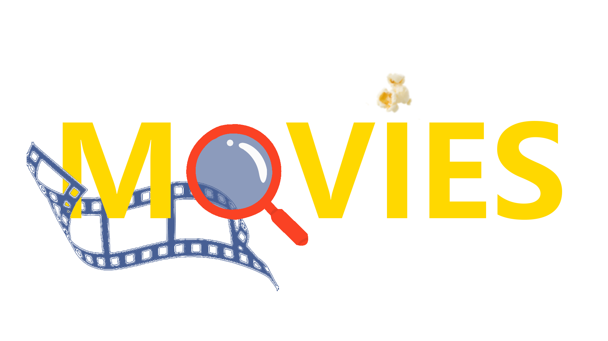

    

Movies é um site que te traz informações sobre filmes, bastando você pesquisar pelo nome do filme.
Esse projeto não tem intenção comercial, foi criado apenas para o estudo de react, styled-components e aplicação de APIs. 

## stack

## Desenvolvido por:

- [Guilherme Cunha](https://github.com/GuilhermeSCunha)

### `yarn start`

Executa o projeto em modo de desenvolvimento.
Abre [http://localhost:3000](http://localhost:3000) para ver o projeto no navegador.

A página vai recarregar quando você salvar as alterações no código.\
Você também consegue ver os erros de código no console.

### `yarn build`

Constrói a aplicação na pasta `build`.\

